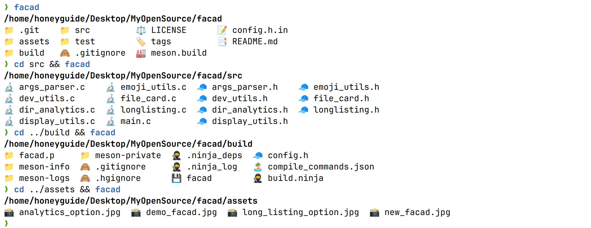

# facad

A modern, colorful directory listing tool for the command line.



## Features
> Designed for both novice users and power users,<br>
> facad feature set aims to enhance file management experience with<br>
> a perfect blend of functionality and simplicity.

- Intuitive file type representation 
- Sorted output with directories first
- Four-column layout for quick directory analysis
- Supports symlinks and executable files
- Sort extensions
- Unicode-aware formatting 


## Getting Started
### Dependencies
- Pure C implementation without any dependency

### Build 
```bash
git clone https://github.com/yellow-footed-honeyguide/facad.git
cd facad
mkdir build && cd build
meson setup .. && ninja
```

### Install
For system-wide installation (may require elevated privileges like `sudo`):
```bash
sudo ninja install
```

## Usage

Run `facad` command for default grid file listing

Run `facad -l` command for long listing output

Run `facad -a` command for dir analytics output

Run `facad -h` command for help

Run `facad -v` command for version


## Contributing

Contributions are welcome! Please feel free to submit a Pull Request.

- Fork the Project
- Create your Feature Branch ( `git checkout -b feature/AmazingFeature` )
- Commit your Changes ( `git commit -m 'Add some AmazingFeature'` )
- Push to the Branch ( `git push origin feature/AmazingFeature` )
- Open a Pull Request

## Author
**Sergey Veneckiy**
- Email: s.venetsky@gmail.com
- GitHub: [@yellow-footed-honeyguide](https://github.com/yellow-footed-honeyguide)


## License
Distributed under the MIT License. See LICENSE for more information.
