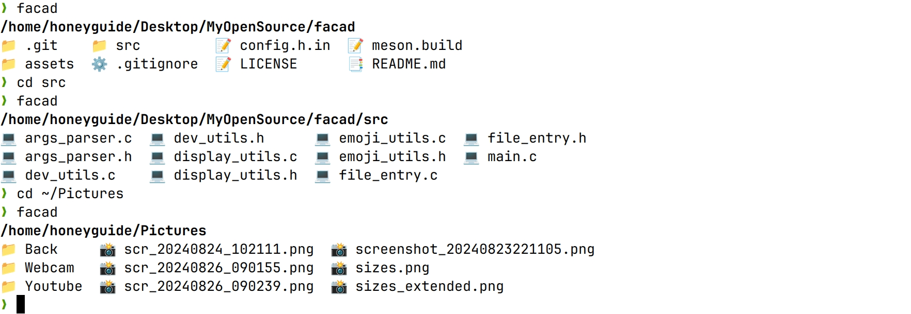

# facad

A modern, colorful directory listing tool for the command line.




## ✨ Features

- 🎨 Emoji-based file and directory icons
- 📁 Sorted output with directories first
- 🔗 Supports symlinks and executable files
- 🧩 Compact grid display
- 📏 Customizable column width
- 🌐 Unicode-aware formatting

### Building from Source

1. Clone the repository:
```
git clone https://github.com/yellow-footed-honeyguide/facad.git
cd facad 
mkdir build && cd build
meson ..
ninja
```
or install facad system-wide:
```
sudo ninja install
```

## 🛠️ Usage
Simply run ```facad``` command.
 


## 🤝 Contributing
Contributions are welcome! Please feel free to submit a Pull Request.

- Fork the Project  
- Create your Feature Branch ( ```git checkout -b feature/AmazingFeature``` )  
- Commit your Changes ( ```git commit -m 'Add some AmazingFeature'``` )  
- Push to the Branch ( ```git push origin feature/AmazingFeature``` )  
- Open a Pull Request

## 📜 License

Distributed under the MIT License. See LICENSE for more information.

## 📞 Contact
Name:  Sergey Veneckiy   

Email: s.venetsky@gmail.com
