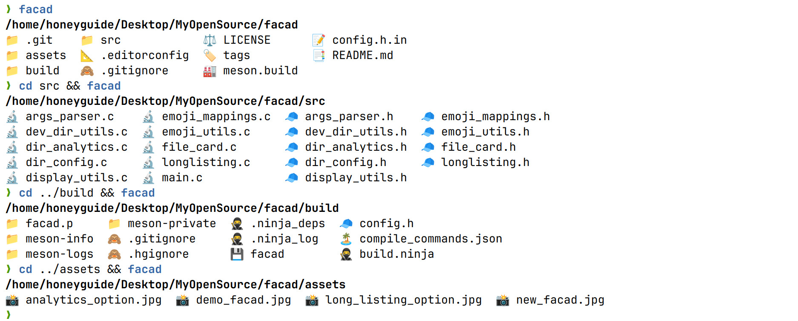

# facad

[](https://yellow-footed-honeyguide.github.io/facad/)
[](https://repology.org/project/facad/versions)
[](https://formulae.brew.sh/formula/facad)

A modern, colorful directory listing tool for the command line.




## Features
> Designed for both novice users and power users,<br>
> facad feature set aims to enhance file management experience with<br>
> a perfect blend of functionality and simplicity.

- Intuitive file type representation 
- Sorted output with directories first
- Four-column layout for quick directory analysis
- Supports symlinks and executable files
- Sort extensions
- Unicode-aware formatting 


## Getting Started
### Dependencies
- Pure C implementation without any dependency

### macOS
facad is available through Homebrew. To install, run:
```bash
brew install facad
```

### I use Arch btw?
Just use the script from AUR:
```bash
yay -S facad
```

### Build & Install from source
```bash
git clone https://github.com/yellow-footed-honeyguide/facad.git
cd facad
meson setup build && meson compile -C build
# now facad binary in build dir

# for system-wide installation (may require elevated privileges like `sudo`):
cd build && sudo ninja install
```

## Usage

Run `facad` command for default grid file listing<br>
Run `facad -h/--help` command for help<br>
Run `facad -v--version` command for version<br>
Run `facad -l/--long` command for long listing output<br>
Run `facad -a/--analytics` command for dir analytics output


## Contributing

Contributions are welcome! Please feel free to submit a Pull Request.

- Fork the Project
- Create your Feature Branch ( `git checkout -b feature/AmazingFeature` )
- Commit your Changes ( `git commit -m 'Add some AmazingFeature'` )
- Push to the Branch ( `git push origin feature/AmazingFeature` )
- Open a Pull Request

## Author
**Sergey Veneckiy**
- Email: s.venetsky@gmail.com
- GitHub: [@yellow-footed-honeyguide](https://github.com/yellow-footed-honeyguide)


## License
Distributed under the MIT License. See LICENSE for more information.
